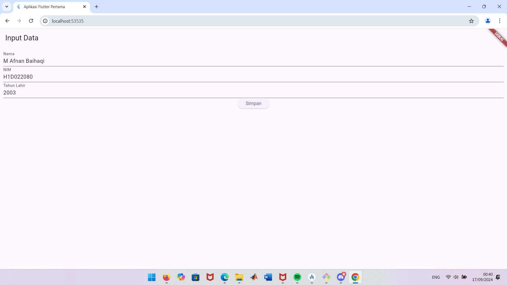
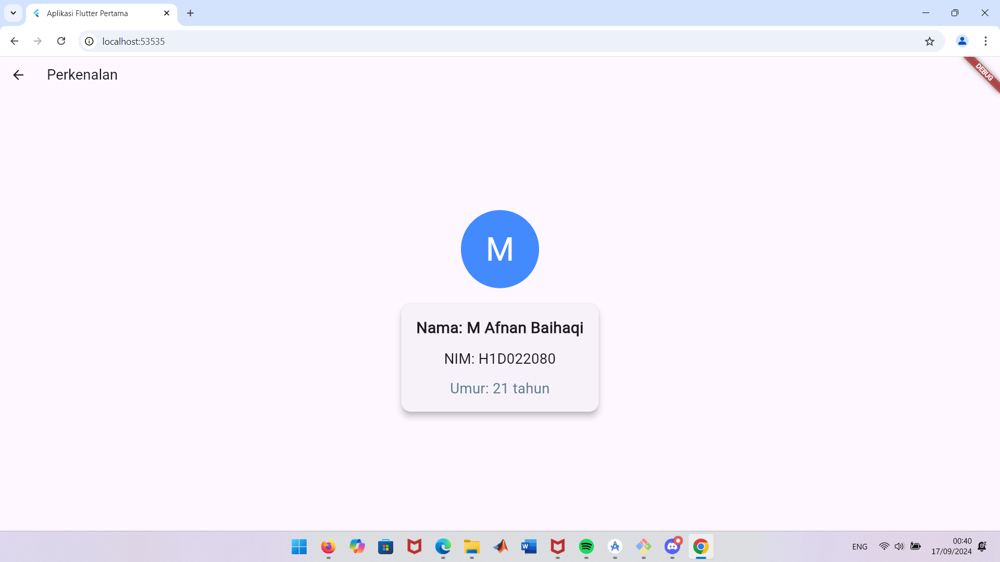

# Tugas Pertemuan 2

Fork dan clone repository ini, lalu jalankan perintah 
```
flutter pub get
```
Buatlah tampilan form yang berisi nama, nim, dan tahun lahir pada file `ui/form_data.dart`, lalu buatlah tampilan hasil dari input data tersebut pada file `ui/tampil_data.dart`

JELASKAN PROSES PASSING DATA DARI FORM MENUJU TAMPILAN DENGAN FILE `README.md`

Penjelasan Proses Passing Data dari Form Menuju Tampilan:

File form_data.dart File ini berisi form input yang menerima nama, NIM, dan tahun lahir. Data ini kemudian diteruskan ke layar lain melalui navigasi. Fungsi ini membaca teks yang di input dan kemudian menggunakan Navigator.of(context).push() untuk membuka layar baru (TampilData) sambil mengirimkan data yang diinput pengguna (nama, NIM, dan tahun lahir) ke layar berikutnya.

File tampil_data.dart File ini adalah layar yang menampilkan data yang diterima dari form. Penampilan Data: Setelah menerima data, widget ini menghitung umur berdasarkan tahun lahir: Lalu, data yang diterima ditampilkan dalam tampilan visual yang dirancang menggunakan CircleAvatar dan Card yang berisi informasi seperti nama, NIM, dan umur.

Buat tampilan semenarik mungkin untuk dilihat.


Nama : M Afnan Baihaqi

NIM : H1D022080

Shift Baru: B

## Screenshot
Contoh :


